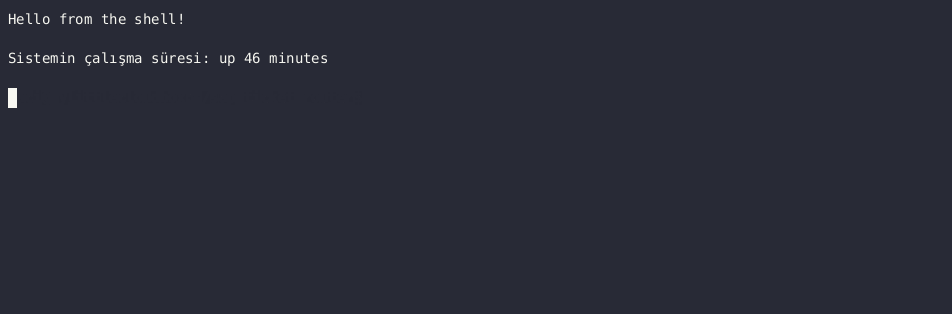

# SAP Ticket Router

Hybrid SAP support ticket classification using a three-layer decision system.

## How It Works

```
Ticket Input
     ↓
Layer 1: Rule Engine (TCODE match + keyword rules) → 100% confidence, no API call
     ↓ no match
Layer 2: TF-IDF Model → fast, offline, no API call
     ↓ low confidence
Layer 3: LLM Fallback (Claude Haiku) → returns module + reasoning
     ↓
{"module": "MM", "confidence": "high", "reason": "..."}
```



## Why Three Layers?

- **Rule Engine:** Zero latency, zero cost. Known TCODEs and keywords are routed instantly.
- **TF-IDF:** Fast and offline. Handles familiar patterns without API calls.
- **LLM Fallback:** Only ambiguous tickets reach Claude. Minimizes API cost.

## Example

```bash
$ python main.py "yetki hatası alıyorum"
{'method': 'rule_override', 'module': 'Authorization', 'confidence': '100%'}

$ python main.py "fatura kesiminde sorun var"
{'method': 'tfidf', 'module': 'E-solutions', 'confidence': '82.25%'}

$ python main.py "malzeme hareketi sırasında sistem donuyor"
{'method': 'llm', 'module': 'MM', 'confidence': 'high'}
```

## Supported Modules

FI/CO · MM · SD · HR · PP · PM · QM · Basis · Authorization · E-Solutions

## Stack

- Python
- Anthropic Claude API (claude-haiku-4-5)
- scikit-learn (TF-IDF + Logistic Regression)
- YAML rule engine
- pandas

## Setup

```bash
python -m venv .venv
source .venv/bin/activate
pip install -r requirements.txt

echo "ANTHROPIC_API_KEY=your_key" > .env

python main.py "ticket text here"
```

## Background

Built from real-world experience managing 250+ SAP BW/4HANA process chains.
Rule engine handles high-confidence cases instantly. TF-IDF covers familiar patterns.
LLM handles ambiguous tickets with reasoning — only when necessary.


## Roadmap

- [ ] **v1.1 — LangSmith Tracing** — trace every decision, track latency and cost
- [ ] **v1.2 — FastAPI endpoint** — HTTP API instead of CLI, `POST /predict` → JSON
- [ ] **v1.3 — Streamlit UI** — enter ticket, see which layer responded
- [ ] **v1.4 — RAGAS eval** — consistency report for LLM decisions
- [ ] **v1.5 — Jira / Teams integration** — auto-assign ticket to the right team
